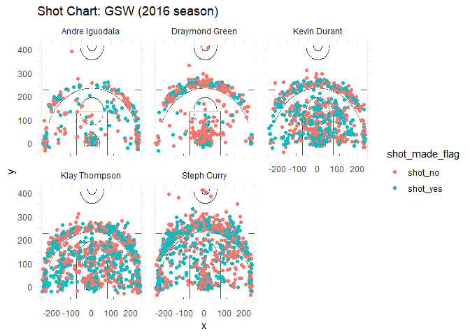

Workout 1
================
Justin Le

``` r
library(readr)
library(dplyr)
library(ggplot2)
library(grid)
library(jpeg)
library(readr)
```

Introduction
============

With the amassing of numerous stars on the Golden State Roster, the natural question to ask is who is the best offensive player? In this article, we will look at the different shooting percentages of the main players on Golden State, and try to sort them by offensive ability. It will be important to take into consideration the Warrior's historic reliance and skill of shooting the three ball, with the added inclusion of Kevin Durant's lethality from the midrange.

Background
==========

Data
====

Let's take a look at the shooting percentages, going by whether the shots taken were two pointers, three pointers, and then both combined.

    ##             Name Total Made Perc_Made
    ## 1 Andre Iguodala   210  134  63.80952
    ## 2   Kevin Durant   643  390  60.65319
    ## 3    Steph Curry   563  304  53.99645
    ## 4  Klay Thompson   640  329  51.40625
    ## 5 Draymond Green   346  171  49.42197

    ##             Name Total Made Perc_Made
    ## 1  Klay Thompson   580  246  42.41379
    ## 2    Steph Curry   687  280  40.75691
    ## 3   Kevin Durant   272  105  38.60294
    ## 4 Andre Iguodala   161   58  36.02484
    ## 5 Draymond Green   232   74  31.89655

    ##             Name Total Made Perc_Made
    ## 1   Kevin Durant   915  495  54.09836
    ## 2 Andre Iguodala   371  192  51.75202
    ## 3  Klay Thompson  1220  575  47.13115
    ## 4    Steph Curry  1250  584  46.72000
    ## 5 Draymond Green   578  245  42.38754

And now let's look at the shot charts of the players.

    ## Warning: Removed 22 rows containing missing values (geom_point).



Analsysis
=========

Conclusions
===========
